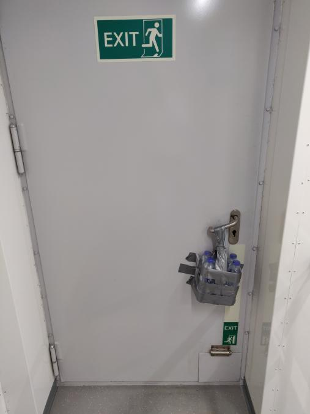
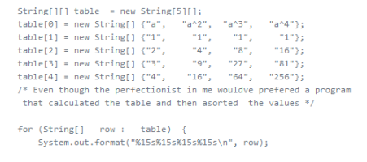
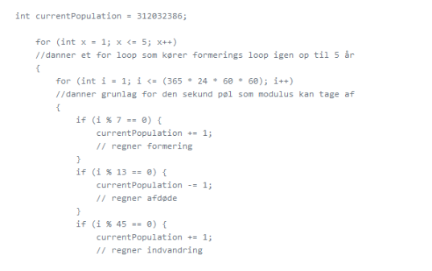

### Fredrik Bille
^Name is stated above^
I am a student of computer science at zealand school of applied sciences. i just started this fall after a five-year sabbatical due to personal reasons. My hobbies might seem very stereotypical of any pc related education, cause we game, we nerd, we obsess and im looking forward to expanding the nerding spektrum while making some money on top of it.

Currently my days are spent learning a new craft, that is programming and pass my freetime by looking at funny pictures and reposting them as funny reactions to others. trying to keep a healthy circle og laughter between my friends group and classmates. other antics would a bit of iceskating coupled with the gravity exercises that follows!

 

## Before

As mentioned i took a five-year sabbaticle, it was planned to only keep me busy for a years' time, but having money, picking working hours
and having a sweet working environment you tend to fall into habits. Which i am terrible at changing. what did this work provide me with?

 - I got better at interacting with all sorts of people, which was a weak point of mine as an introvert.
 
 - I got used the responsibilities of having a full-time job, the free of a part-time job and learned the importance of taking breaks.
 
 - I'd like to believe i became good at both problem solving and prevention, doing so with minimal resources available.
 
   (disclaimer: *the situation in the picture is not my brainchild, i was just on my way to lunch!*)

## Now

>All was good, you had money, time off when you wanted, what went wrong?Well conditions changed.

I had for a while thought that the place i was working was a joke from a concept standpoint, and the management was a bunch of cheapskates.
So, me and my buddies from the same team all took the decisions to look around for alternatives, computer sciences had was my first choice around, so i applied
only to that and decided i would take till winter to look around if i did not get accepted. Well the result was the favourable one and i hope my leap of faith
will inspire my buddies to do the same!

### Right now!

I am showing up every day, trying my best and resolved to keep at it and leave my procrastinating self in the dust!
school is going fine i would say, i am in a study group with some people that are way better at coding than me, which can admittedly be a little disheartening
but i persevere and try my best to learn from their experience and keep up.

So far, we have made several pieces of code, and a bit of math...

- We made a table to neatly display a table of information

Click to expand!

- We made a piece of code to calculate the increase in a country's population based on births, immigration and factoring deaths (given parameters)

Click to expand!

 

### Future

 
Click to expand!

 
 
 
 
Well i have no idea why i can't shrink this picture, but hey what i am doing is learning and twice now in this assignment i am baffled at how stuff is working,
or maybe not so much. But i digress and hope it has been a semi-enjoyable read and wish you a good night.
WAIT! one more thing, there's another picture i think you need below.

 
Click to expand!

 
 
**This is baby toucan, i thought you might like it**

 
 

